# Sơ đồ hệ thống ticketing

ERD sinh từ schema thật của Postgres (Flyway `V1`–`V6`); state machine và luồng xử lý đọc từ code.

- [1–6. ERD theo nhóm bảng](#1-toàn-cảnh)
- [7. State machine: Order](#7-state-machine-order)
- [8. State machine: Payment](#8-state-machine-payment)
- [9. Luồng tạo đơn và link thanh toán](#9-luồng-tạo-đơn-và-link-thanh-toán)
- [10. Luồng webhook thanh toán](#10-luồng-webhook-thanh-toán)
- [11. Luồng hết hạn và đối soát](#11-luồng-hết-hạn-và-đối-soát)

> Xem sơ đồ: GitHub, IntelliJ và VS Code (extension Markdown Preview Mermaid) đều render trực tiếp.

---

## 1. Toàn cảnh

Chỉ vẽ quan hệ và khóa; cột đầy đủ ở phần chi tiết bên dưới.

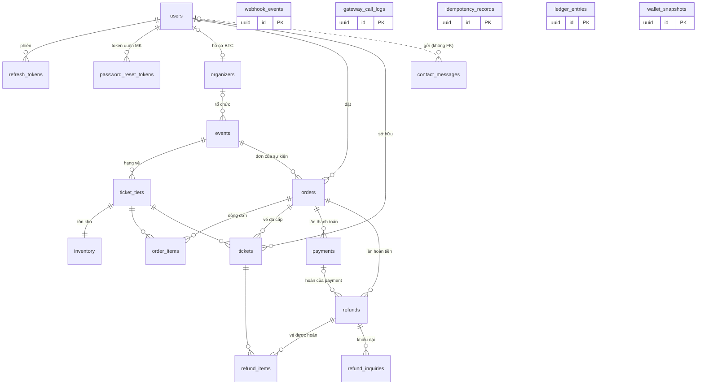

5 bảng này **không có khóa ngoại** — chúng tham chiếu mềm qua `ref_type` + `ref_id` hoặc đứng độc lập, để ghi sổ/audit không chặn việc xóa dữ liệu nghiệp vụ.

---

## 2. Danh tính & tài khoản

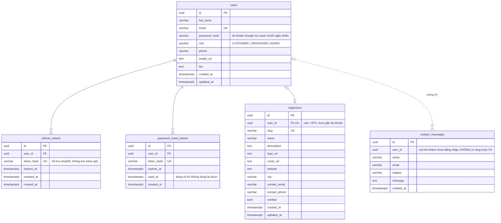

---

## 3. Sự kiện & kho vé

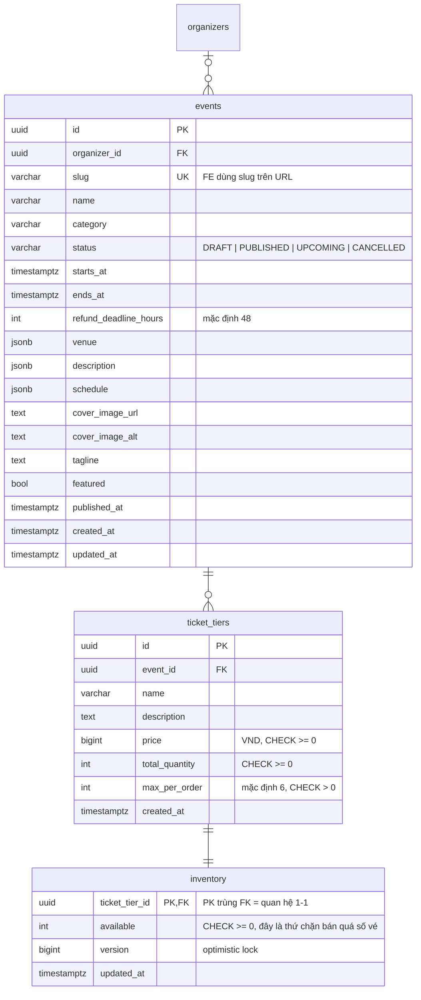

`inventory` tách khỏi `ticket_tiers` vì đây là dòng bị khóa (`SELECT ... FOR UPDATE`) mỗi lần checkout. Tách ra thì việc BTC sửa thông tin hạng vé không tranh khóa với người đang mua.

---

## 4. Đơn hàng & vé

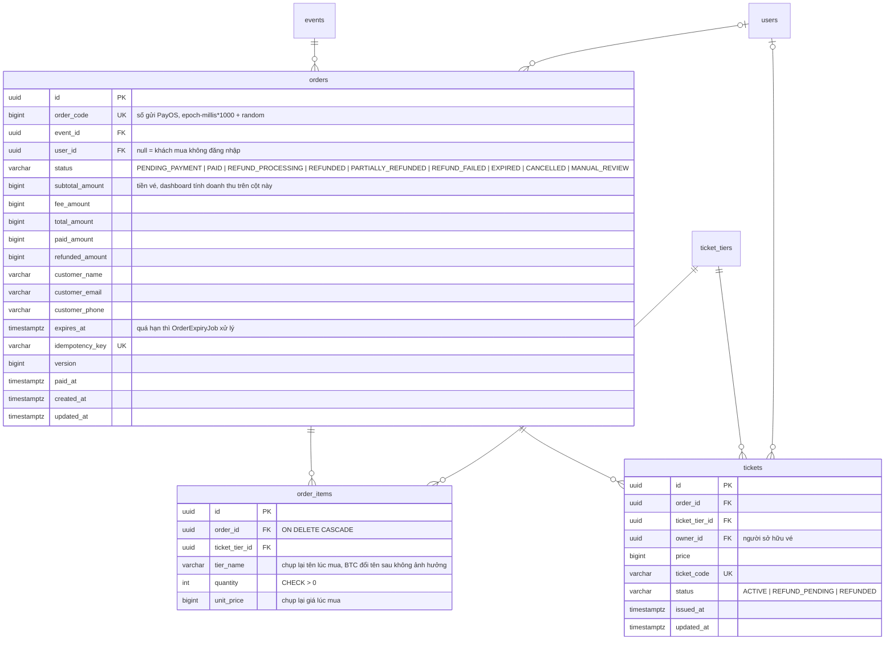

`order_items` là **ý định mua** (mua mấy vé hạng nào), `tickets` là **vé thật** chỉ sinh ra khi đơn đã PAID. Cả hai chụp lại `tier_name`/`price` tại thời điểm mua.

---

## 5. Thanh toán & hoàn tiền

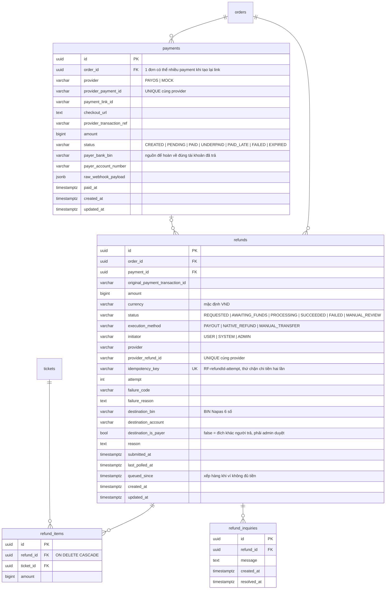

`UNIQUE (refund_id, ticket_id)` trên `refund_items` chặn hoàn cùng một vé hai lần trong một refund.

---

## 6. Hạ tầng: audit, idempotency, sổ tiền

Không có khóa ngoại, tham chiếu mềm qua `ref_type` + `ref_id`.

```mermaid
erDiagram
    webhook_events {
        uuid id PK
        varchar provider
        varchar event_id "UNIQUE cùng provider, đây là thứ chặn webhook trùng"
        varchar event_type "payment | refund"
        jsonb raw_payload
        bool signature_valid
        varchar processing_result "PROCESSED | DUPLICATE | IGNORED | REJECTED_SIGNATURE | FAILED"
        timestamptz received_at
        timestamptz processed_at
    }

    gateway_call_logs {
        uuid id PK
        varchar ref_type "ORDER | PAYMENT | REFUND"
        uuid ref_id "không FK: giữ log kể cả khi bản ghi gốc bị xóa"
        varchar direction "OUTBOUND | INBOUND"
        text endpoint
        jsonb request_masked "đã che secret trước khi lưu"
        jsonb response_raw
        int http_status
        int duration_ms
        varchar trace_id
        timestamptz created_at
    }

    idempotency_records {
        uuid id PK
        varchar scope "CHECKOUT | REFUND"
        varchar idem_key "UNIQUE cùng scope"
        varchar request_hash "băm body để phát hiện cùng key khác body"
        int response_status
        jsonb response_body "trả lại nguyên kết quả cũ"
        timestamptz created_at
    }

    ledger_entries {
        uuid id PK
        varchar account "BANK_COLLECTION | PAYOUT_WALLET | CUSTOMER_LIABILITY | FEES"
        varchar direction "DEBIT | CREDIT"
        bigint amount
        varchar ref_type "ORDER | REFUND"
        uuid ref_id "không FK: sổ phải sống lâu hơn bản ghi nghiệp vụ"
        timestamptz occurred_at
    }

    wallet_snapshots {
        uuid id PK
        bigint balance
        bigint committed
        bigint available
        bigint liability
        numeric coverage
        timestamptz taken_at
    }
```

---

## Ghi chú

**Sổ bút toán kép (`ledger_entries`)** — `LedgerService` ghi, mỗi sự kiện một bộ vế cân nhau:

| Sự kiện | Nợ | Có | Ghi ở |
|---|---|---|---|
| Đơn sang PAID | `BANK_COLLECTION` | `CUSTOMER_LIABILITY` (+ `FEES` nếu `fee_amount` > 0) | `PaymentServiceImpl.apply()` |
| Refund SUCCEEDED | `CUSTOMER_LIABILITY` | `PAYOUT_WALLET` | `RefundResultHandler.apply()` |

Chỉ thêm, không sửa không xóa. Lệnh hoàn **đang bay không vào sổ** — chưa chuyển tiền thì chưa phải bút toán;
phần đó `RefundResultHandler.assertNotOverRefunded()` đếm từ bảng `refunds`. Trần hoàn tiền vì vậy tính từ
dữ liệu bất biến (sổ) thay vì từ cột `orders.refunded_amount` sửa được.

`V6__ledger_backfill.sql` dựng lại bút toán cho đơn đã PAID trước khi có sổ; `db/seed-dev.sql` cũng sinh
bút toán cho đơn seed, nếu không thì `paidIn = 0` và invariant tự tắt.

**2 bảng có trong schema nhưng code chưa dùng** — không có entity JPA nào map tới:

| Bảng | Dự định |
|---|---|
| `wallet_snapshots` | Lịch sử số dư ví chi (hiện `WalletService` tính trực tiếp từ provider) |
| `refund_inquiries` | Khiếu nại hoàn tiền |

**Quan hệ nét đứt** (`contact_messages.user_id`) là tham chiếu mềm: có cột nhưng không có ràng buộc FK, nên xóa user không vướng tin nhắn cũ.

**Xóa lan (`ON DELETE CASCADE`)** chỉ có ở 2 chỗ: `order_items → orders` và `refund_items → refunds`. Mọi FK còn lại là `NO ACTION` — cố ý, để không xóa nhầm dữ liệu tiền bạc.

**Phí sàn đã bỏ** (`app.checkout.fee` mặc định `0`): hệ thống không chia tiền, PayOS trả vào một tài khoản merchant duy nhất và `organizers` không có cột ngân hàng nào. Cột `fee_amount` giữ lại để bật lại được, đơn mới đều là `0`.

**Khóa lạc quan (`version`)** ở `orders` và `inventory`.

**Chuỗi bí mật không bao giờ lưu dạng gốc**: `refresh_tokens.token_hash` và `password_reset_tokens.token_hash` đều là sha256.

Schema do Flyway quản lý ở `src/main/resources/db/migration`; Hibernate chỉ `validate`, không tự sửa bảng.

---

## 7. State machine: Order

Đọc từ `domain/order/Order.java`. Mỗi mũi tên là một method; điều kiện chuyển nằm ngay trong method đó, sai trạng thái thì ném lỗi chứ không chuyển âm thầm.

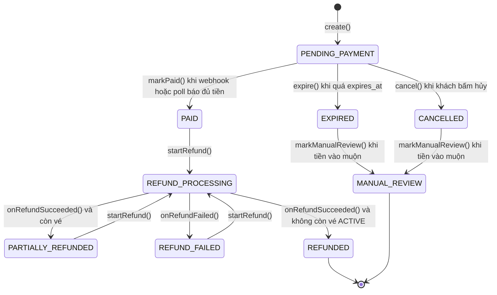

| Guard trong code | Ý nghĩa |
|---|---|
| `requirePending()` | `expire()` và `markPaid()` chỉ chạy từ `PENDING_PAYMENT` |
| `cancel()` | Khác `PENDING_PAYMENT` → 409 `ORDER_NOT_CANCELLABLE` |
| `isRefundable()` | Chỉ `PAID`, `PARTIALLY_REFUNDED`, `REFUND_FAILED` mới mở refund được |
| `markManualReview()` | Chỉ từ `EXPIRED` hoặc `CANCELLED` |
| `requireRefundProcessing()` | Kết quả refund chỉ nhận khi đang `REFUND_PROCESSING` |

`REFUNDED` là terminal: nó không nằm trong `isRefundable()` nên không mở thêm refund được nữa.

---

## 8. State machine: Payment

Một đơn có thể có **nhiều** payment (mỗi lần tạo lại link là một bản ghi); `PaymentServiceImpl` luôn lấy bản ghi mới nhất.

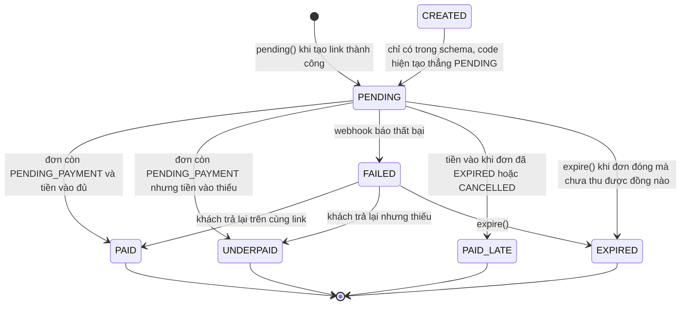

**Điều quan trọng, dễ hiểu nhầm:** `Payment.apply()` gán status **không kiểm tra gì cả**. Toàn bộ điều kiện chuyển nằm ở `PaymentServiceImpl.apply()` (bên gọi), theo đúng bảng này:

| Trạng thái đơn | Webhook | Kết quả |
|---|---|---|
| `PAID` | bất kỳ | `IGNORED`, không đụng payment |
| `PENDING_PAYMENT` | thất bại, payment `isAwaitingMoney()` | `markFailed()` |
| `PENDING_PAYMENT` | thành công, `amount < total` | `markUnderpaid()` |
| `PENDING_PAYMENT` | thành công, đủ tiền | `confirmPaid()` + `order.markPaid()` + cấp vé |
| `EXPIRED` / `CANCELLED` | thành công | `markLate()` + `order.markManualReview()` |
| còn lại | | `IGNORED` |

`isAwaitingMoney()` = `PENDING`, `CREATED`, `FAILED` — nghĩa là **chưa nhận đồng nào**. Webhook thất bại chỉ được ghi đè ở nhóm này, không bao giờ xóa dấu vết tiền đã vào (`UNDERPAID`, `PAID_LATE` giữ nguyên để đối soát).

---

## 9. Luồng tạo đơn và link thanh toán

`POST /api/v1/orders` — `CheckoutServiceImpl.checkout()`.

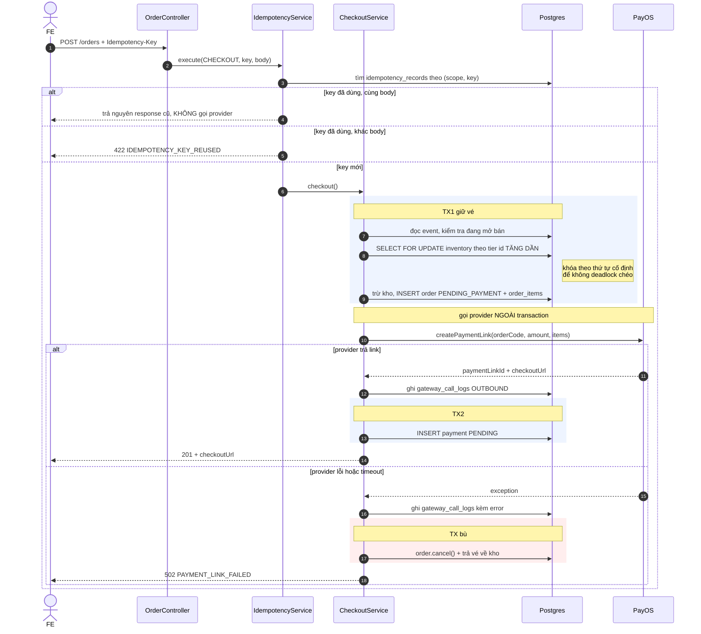

Điểm cốt lõi: **không bao giờ gọi provider khi đang giữ transaction**. Giữ vé xong thì đóng TX1, gọi PayOS, rồi mở TX2 ghi payment. Đổi lại phải có nhánh bù (hủy đơn + trả vé) khi provider lỗi.

---

## 10. Luồng webhook thanh toán

`POST /webhooks/payos/payment` — `PaymentServiceImpl.handleWebhook()`.

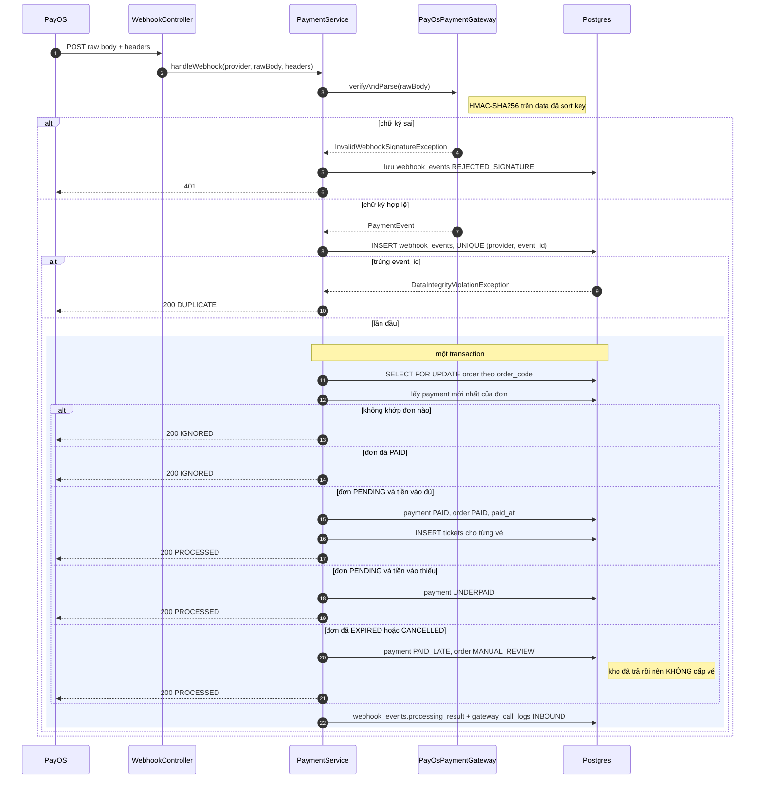

Chống webhook trùng bằng **ràng buộc DB** (`UNIQUE (provider, event_id)`) chứ không bằng kiểm tra trong code — hai webhook đến cùng lúc thì một cái chắc chắn thua ở tầng DB.

Trừ lỗi chữ ký (401), mọi trường hợp còn lại đều trả **200**. Provider chỉ cần biết "đã nhận", không cần biết nghiệp vụ xử lý ra sao.

---

## 11. Luồng hết hạn và đối soát

Đây là lý do một đơn có thể thành `PAID` mà **không** có webhook nào về.

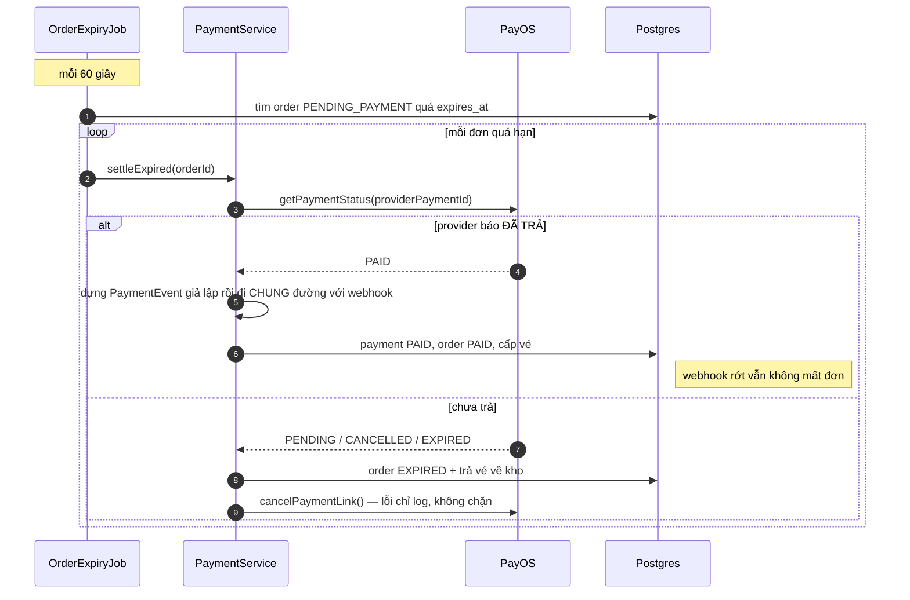

`PaymentReconcileJob` chạy mỗi 5 phút cũng theo đúng đường này nhưng cho đơn **sắp** hết hạn, để phát hiện sớm khi webhook rớt.

Cả hai job đều đi qua `record()` giống hệt webhook, nên kết quả của một đơn không phụ thuộc vào việc nó được xử lý bằng webhook hay bằng poll.
